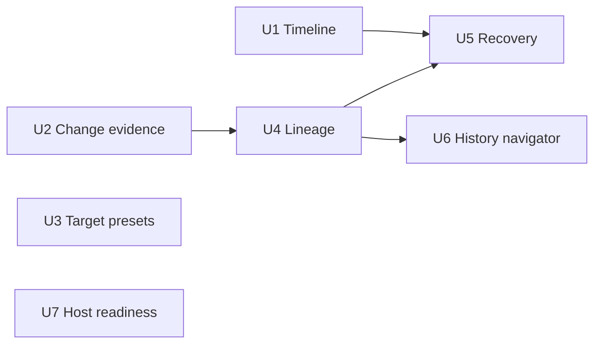

# Operator console capability plan

**Summary:** Deliver the seven ranked operator-console capabilities as a safety-preserving **P1** sequence on top of the **delivered P0 foundation**: durable redacted lifecycle evidence, a bounded pre-publish evidence card, target-aware verification defaults, explicit run lineage and recovery, searchable retained history, and a non-secret host readiness panel. P1 keeps Shipwright single-operator, dry-run-first, and confirmation-gated for **manual** runs.

**Cursor Agents parity** (persistent cloud agents, GitHub/schedule/webhook triggers, enable/disable lifecycle, agent configuration, run history/controls, scoped-credential safety model) is **not** defined here. It lives in the separate Phase 2 plan: [`docs/plans/2026-07-21-shipwright-automation-agents-plan.md`](2026-07-21-shipwright-automation-agents-plan.md).

## End goal: Cursor Agents parity

Shipwright should converge on the operator model Cursor exposes for **Agents** (not just Automations UX polish):

| Cursor Agents capability | Shipwright today (P0 delivered) | P1 (this plan) | Phase 2 (future) |
| --- | --- | --- | --- |
| Always-on cloud agents | Host-local, on-demand runs only | Durable records, recovery, readiness — trustworthy manual cockpit | Persistent agent profiles bound to repo/environment; cloud-hosted execution surface |
| Trigger-based automation | Manual paste-and-go intake only | Target-aware defaults + searchable history make repeat work faster | GitHub/webhook/schedule triggers that enqueue configured agent runs |
| Enable/disable lifecycle | No automation entity; runs are one-offs | History shows terminal status; no autonomous toggle | Named automations/agents with explicit enabled/disabled state and audit trail |
| Agent configuration | Per-run intake (target, skill, verify, timeout) | Self-explanatory run profiles, lineage, draft replay from history | Durable agent definitions: instructions, tools, repo/branch, triggers, verification policy |

**Phasing contract:**

1. **P0 — delivered foundation** (`docs/plans/2026-07-20-feat-operator-console-p0-ux-plan.md`): task-oriented three-column console, server-owned verify presets and `skillId`, URL preflight, durable records, retry/publish-from-prior-inputs, demo/live disclosure, pipeline-true publish, and single next-action CTAs. Do not retroactively rewrite P0 scope.
2. **P1 — this plan:** close the seven ranked evidence/recovery/intake gaps so manual operation is auditable, recoverable, and repeatable — the prerequisite cockpit for automation.
3. **Phase 2 — Cursor Agents parity:** add automation entities, triggers, enable/disable lifecycle, and durable agent configuration while preserving Shipwright’s allowlist, host-side credentials, dry-run default, and publish double-confirmation as non-negotiable safety boundaries unless explicitly redesigned.

Cursor Automations remains a **UX reference** for scanability (KPIs, filters, dense tables, configuration-vs-history separation). Cursor **Agents** is the **product north star** for capability parity.

## Current state

**P0 is delivered.** The merged console on `main` already has URL preflight, a server-owned verification preset registry, durable records, retry/publish-from-prior-inputs, demo/live disclosure, phase/receipt evidence, and a history rail. `OperatorRunRegistry` receives phase progress from both issue and review pipelines, persists records atomically, reconciles interrupted runs on load, and exposes a newest-first bounded list.

The remaining gaps are the seven unstarted P4 children of `td-459f83`, not a missing execution foundation. P1 does not implement Phase 2 automation; it makes the manual operator path strong enough to grow into it.

- `ui/shared/operator-run.ts` defines the durable request, target, receipt, and record contracts.
- `ui/server/operator-runs.ts` is the persistence, reconciliation, and single-active-run boundary.
- `ui/app/components/operator/OperatorConsole.tsx` owns history selection, intake, confirmation, and evidence UI.
- `ui/server/verify-presets.ts` currently exposes only global presets.
- `src/pipeline/run.ts` and `src/pipeline/review-run.ts` emit phase progress; they must remain the source of lifecycle truth.

## Requirements

- **R1 — Redacted lifecycle evidence.** Every run persists an ordered, bounded phase timeline generated from static server templates. Timeline entries may contain phase, timestamp, status, and safe counts/identifiers already present on the record; they must not contain raw model, provider, command-output, error, GitHub API, or secret-looking text.
- **R2 — Reviewable dry-run evidence.** A successful dry run exposes a concise, deterministic change-evidence card before the operator starts a new publish run. It must state that publication reruns and re-verifies; it must never imply workspace promotion.
- **R3 — Target-aware verification defaults.** The server selects an auditable verification preset using a parsed target and documented precedence. Operators may still choose another preset or use the existing Advanced raw-command path.
- **R4 — Safe recovery.** Refresh/restart restores the most actionable persisted record into the console, labels interrupted work accurately, and never restarts work automatically.
- **R5 — Durable lineage and intentional replay.** Retry and publish-from-dry records persist parent/root lineage. Operators can load prior inputs as a draft without starting a run; direct retry remains explicit.
- **R6 — Retained, searchable history.** The history API provides server-side target, status, mode, and date filtering plus cursor pagination and an explicit retention summary. It preserves the active record and bounds terminal-history growth.
- **R7 — Non-secret readiness.** The console can display provider configuration, GitHub App configuration, sandbox availability, and state-store health as `ready`, `not_configured`, or `unavailable`, without exposing values, probing a model, mutating GitHub, or creating a sandbox.
- **R8 — Shared behavior.** Issue and review runs receive the same timeline, lineage, recovery, and history contracts; mode-specific thread data remains confined to existing receipts.
- **R9 — Existing safety invariants.** Preserve exact allowlist authorization, receipt redaction, one active run, cancellation through `AbortSignal`, named skill resolution, and publish double confirmation.
- **R10 — P1 scope boundary.** P1 adds manual-operator evidence, recovery, and intake improvements only. It does not implement cloud agent profiles, trigger ingress, schedulers, or enable/disable automation entities — those are Phase 2 ([`docs/plans/2026-07-21-shipwright-automation-agents-plan.md`](2026-07-21-shipwright-automation-agents-plan.md)). Within P1: no recurring poller beyond existing UI query refetching, no new paid dependency/API call, and no external telemetry.

## Technical decisions

1. **Timeline entries are server-authored projections, not a receipt mirror.** Add a compact `OperatorRunEvent` to the durable run record. The registry appends a static event at queued, progress-phase transition, terminal success, terminal failure, and cancellation. Deduplicate unchanged phase/status transitions, cap at 32 entries per run, and redact all text through the existing receipt-redaction path before persistence. This uses the existing progress callback rather than adding pipeline logging channels.
2. **Evidence is factual, not model-scored.** The pre-publish card derives only target metadata, pinned/base SHA, changed-file count and bounded names, verification command/result, commit SHA, and PR URL when present. Do not create a risk score, LLM summary, or raw diff storage.
3. **Preset matching is server-owned and explainable.** Extend preset metadata with optional repository match rules. Selection precedence is exact `owner/repo` match, then anchored repository glob match, then default preset. Persist both the chosen `presetId` and resolved command already used by the sandbox; include a non-secret `selectionReason` for the UI.
4. **Lineage is data, not inference.** Add optional `parentRunId` and required-by-construction `rootRunId` to new records. Legacy records remain rootless and render as standalone. `fromRunId` creates a new record only; “load as draft” hydrates client form state and does not call `start`.
5. **Recovery is selection, never resumption.** On history load, choose an active run first, then the latest interrupted/failed run with a recovery CTA, then the latest terminal record. The registry’s existing restart reconciliation remains authoritative; no background retry or sandbox reuse is introduced.
6. **History is filtered at the registry.** Replace the `list(limit)`-only action with a backwards-compatible request accepting `query`, `status`, `mode`, `from`, `to`, `cursor`, and `limit`. Retain at most 500 terminal records, pruning only after a successful atomic save and never pruning active/nonterminal records. Return `total`, `nextCursor`, and earliest retained timestamp.
7. **Readiness probes are injected and passive.** New server probe interfaces check only configuration presence/shape, GitHub App credential configuration, Docker/socket reachability, and JSON-store readability. They do not call a model, make GitHub requests, write records, or start a container. The UI fetches on page load and explicit refresh; it does not poll continuously.

## Implementation units

### U1. Redacted phase timeline — `td-1c9835`

**Goal:** Persist an operator-readable lifecycle sequence for issue and review runs without persisting raw execution content.

**Requirements:** R1, R8, R9.

**Files:**
- `ui/shared/operator-run.ts`
- `ui/shared/operator-run.spec.ts`
- `ui/server/operator-runs.ts`
- `ui/server/operator-runs.spec.ts`
- `ui/app/components/operator/OperatorConsole.tsx`
- `ui/README.md`

**Approach:**
1. Define `OperatorRunEvent` with `at`, `phase`, `status`, `kind`, and a static `summary` selected from a closed template map.
2. Normalize legacy records with an empty event list. Append events only in registry transitions; do not let the browser provide entries.
3. Produce phase summaries from static facts already in the record: e.g., “Verification started,” “Verification passed,” “Publish completed,” or “Run interrupted after service restart.” Use counts only when they are already durable and non-secret.
4. Redact/trim before every write, deduplicate adjacent identical phase/status events, and cap a run at 32 events.
5. Render a compact newest-last timeline in the evidence column with timestamps, phase labels, and terminal-state emphasis. Keep existing receipt/log-tail disclosures separate.

**Tests:** Table-driven transition tests for issue and review records; duplicate/cap behavior; legacy load; restart reconciliation; redaction of a synthetic error-like string; UI rendering of ordered events.

**Verification:** `cd ui && pnpm exec vitest run shared/operator-run.spec.ts server/operator-runs.spec.ts`; manual demo dry run shows phase progression and a persisted terminal timeline after refresh.

### U2. Reviewable change-evidence card — `td-2e3395`

**Goal:** Give the publish confirmation an accurate, bounded summary of the prior dry-run result without turning it into an in-place promotion screen.

**Requirements:** R2, R9.

**Files:**
- `ui/shared/operator-run.ts`
- `ui/shared/operator-run.spec.ts`
- `ui/server/operator-runs.ts`
- `ui/server/operator-runs.spec.ts`
- `ui/app/components/operator/OperatorConsole.tsx`
- `ui/README.md`

**Approach:**
1. Add a pure `buildOperatorChangeEvidence(record)` projection that returns only safe receipt fields and never reads raw patch/workspace data.
2. Include target, dry-run timestamp/duration, prior base SHA, verification command/result, changed-file count, up to 10 basename-preserving file paths after `redactSecrets`, commit SHA, and PR URL when one exists.
3. Store the projection only if its inputs are already durable; otherwise derive it at read time. Do not add another source of truth or duplicate a receipt.
4. Show the card in the publish confirmation when `sourceRunId` exists. Preserve the prominent copy that this starts a new run, may produce a different diff, re-authorizes, and re-verifies.
5. Keep direct Publish from new intake free of invented prior evidence.

**Tests:** Dry-run succeeded/failed/published/no-receipt cases; changed-file truncation/redaction; confirmation projection uses prior record only; UI copy asserts rerun semantics.

**Verification:** `cd ui && pnpm exec vitest run shared/operator-run.spec.ts server/operator-runs.spec.ts`; manual demo confirms a dry-run’s card appears before publish denial and no fake PR/SHA is created.

### U3. Target-aware verification presets — `td-2271ff`

**Goal:** Select the most suitable server-owned verification default for the resolved repository while keeping operator choice auditable.

**Requirements:** R3, R9, R10.

**Files:**
- `ui/server/verify-presets.ts`
- `ui/server/verify-presets.spec.ts` (new)
- `ui/actions/list-verify-presets.ts`
- `ui/server/operator-runs.ts`
- `ui/server/operator-runs.spec.ts`
- `ui/shared/operator-run.ts`
- `ui/shared/operator-run.spec.ts`
- `ui/app/components/operator/OperatorConsole.tsx`
- `ui/README.md`, `.env.example`

**Approach:**
1. Extend `VerifyPreset` with optional target match metadata and expose a pure `selectVerifyPreset(target, requestedPresetId?)` result with `preset`, `selectionReason`, and matching source.
2. Load optional host configuration from one documented non-secret JSON environment variable. Validate all entries at startup; reject malformed configuration without silently falling back to an unintended command.
3. Use exact repository match, then anchored glob match, then the existing default. An explicit operator preset choice always wins; Advanced raw verify remains opt-in and follows existing validation.
4. At start, resolve against the canonical parsed/preflight target rather than client-provided owner/repo fields. Persist selected id and resolved command, plus a safe selection reason on the run metadata.
5. In the form, show the proposed preset and why it was chosen. Never hide an automatically selected command or modify a raw Advanced command.

**Tests:** Exact-over-glob-over-default precedence; invalid configuration; explicit override; raw-command path unchanged; persisted selection audit fields; issue and review target parity.

**Verification:** `cd ui && pnpm exec vitest run server/verify-presets.spec.ts shared/operator-run.spec.ts server/operator-runs.spec.ts`; manual demo verifies the default explanation changes only for a configured target match.

### U4. Linked run lineage and draft replay — `td-ba32d0`

**Goal:** Make retry/publish chains visible and let an operator intentionally reuse prior inputs without starting work.

**Requirements:** R5, R8, R9.

**Files:**
- `ui/shared/operator-run.ts`
- `ui/shared/operator-run.spec.ts`
- `ui/server/operator-runs.ts`
- `ui/server/operator-runs.spec.ts`
- `ui/actions/get-shipwright-run.ts` (only if expanded read data needs a dedicated action)
- `ui/app/components/operator/OperatorConsole.tsx`
- `ui/README.md`

**Approach:**
1. When `fromRunId` starts a new record, persist `parentRunId` and inherited `rootRunId`. Fresh runs set their own `rootRunId`; normalize legacy records without changing historic meaning.
2. Add a pure lineage resolver that returns parent/root chain with cycle/depth guards. It must tolerate missing/pruned ancestors.
3. Add “Load as draft” for terminal historical records. It hydrates mode, target URL, skill id, preset/raw verification choice, and timeout, clears publish confirmation, and shows no active run until the operator presses Dry run or Publish.
4. Keep “Retry dry run” and “Start publish run (same inputs)” as distinct execution actions. The latter still opens the confirmation sheet and reruns the agent.
5. Render compact parent/root links in history/evidence; do not manufacture lineage from matching URLs or titles.

**Tests:** Fresh root, dry→retry, dry→publish, multi-step chain, missing parent, legacy record, and draft hydration that performs no `start` mutation.

**Verification:** `cd ui && pnpm exec vitest run shared/operator-run.spec.ts server/operator-runs.spec.ts`; manual demo makes a dry→retry→publish lineage visible and proves Load as draft does not create a new run.

### U5. Run recovery cockpit — `td-624d0f`

**Goal:** Restore the most useful persisted state after refresh/restart and expose the safe next recovery action.

**Requirements:** R4, R5, R8, R9.

**Files:**
- `ui/shared/operator-run.ts`
- `ui/shared/operator-run.spec.ts`
- `ui/server/operator-runs.ts`
- `ui/server/operator-runs.spec.ts`
- `ui/actions/list-shipwright-runs.ts`
- `ui/app/components/operator/OperatorConsole.tsx`
- `ui/README.md`

**Approach:**
1. Add a pure `resolveRecoverySelection(records)` that selects active, then latest interrupted/recoverable, then latest terminal run. The selection must be deterministic and side-effect free.
2. Expand the existing static `operatorHint` map for restart interruption, authorization denial, verification failure, cancellation, and legacy records. Do not turn pipeline/model messages into hints.
3. Seed console selection from recovery only when there is no operator-selected `runId`; preserve manual selection and URL-entry state.
4. Show a recovery strip with the run’s state, timestamp, interruption/failure reason, lineage context, and existing safe CTA. Never automatically call `start`, `cancel`, or publish.
5. Clear the recovery strip only after the operator selects another record, starts a run, or explicitly dismisses it for the browser session.

**Tests:** Selection priority; refresh with a manually selected historical record; startup-reconciled interruption; each recovery hint; no action mutation during selection.

**Verification:** `cd ui && pnpm exec vitest run shared/operator-run.spec.ts server/operator-runs.spec.ts`; manual restart of demo server shows an interrupted/last run selected with a retry-or-edit CTA and no automatic execution.

### U6. Searchable retained run-history navigator — `td-c69db4`

**Goal:** Let one operator find prior attempts without unbounded JSON-store growth or a second dashboard.

**Requirements:** R5, R6, R8, R9, R10.

**Files:**
- `ui/shared/operator-run.ts`
- `ui/shared/operator-run.spec.ts`
- `ui/server/operator-runs.ts`
- `ui/server/operator-runs.spec.ts`
- `ui/actions/list-shipwright-runs.ts`
- `ui/app/components/operator/OperatorConsole.tsx`
- `ui/README.md`

**Approach:**
1. Define a validated list request and response: text query, status/mode filters, optional inclusive date bounds, opaque cursor, page size 1–100, total matching count, next cursor, total retained count, and earliest retained timestamp.
2. Filter and sort in `OperatorRunRegistry`; search only safe target title/owner/repo/number, run summary, and run id prefix. Never search receipt log tails, error bodies, skill content, or raw URLs beyond their parsed target fields.
3. Enforce a 500-terminal-record retention ceiling during successful registry persistence. Preserve active/nonterminal records and retain lineage ancestors required by an active or selected descendant; expose the resulting retention window rather than hiding pruning.
4. Replace the history rail’s unfiltered 50-item list with debounced search, compact filters, next/previous paging, and a retention note. Keep the selected record’s evidence panel stable while filters change.
5. Reuse U4 lineage labels rather than building a second history model.

**Tests:** Filter combinations, cursor stability, query boundary, no-searchable sensitive receipt text, retention pruning, active-record preservation, lineage-ancestor preservation, and old action callers using the default first page.

**Verification:** `cd ui && pnpm exec vitest run shared/operator-run.spec.ts server/operator-runs.spec.ts`; manual demo creates enough fixture records to validate filtering, paging, selection stability, and retention disclosure.

### U7. Non-secret host readiness panel — `td-c1adc9`

**Goal:** Tell the operator whether local prerequisites are usable before they attempt a run, without exposing or exercising credentials.

**Requirements:** R7, R9, R10.

**Files:**
- `ui/shared/host-readiness.ts` (new)
- `ui/shared/host-readiness.spec.ts` (new)
- `ui/server/host-readiness.ts` (new)
- `ui/server/host-readiness.spec.ts` (new)
- `ui/actions/get-host-readiness.ts` (new)
- `ui/app/components/operator/OperatorConsole.tsx`
- `ui/README.md`, `.env.example`

**Approach:**
1. Define a redacted component status contract with only `ready`, `not_configured`, or `unavailable`, a short fixed explanation code, and `checkedAt`.
2. Inject probes for configured model/provider identity, GitHub App configuration, Docker/socket availability, and JSON state-store readability. Expose demo mode explicitly instead of claiming live readiness.
3. Ensure probes perform no model request, GitHub HTTP request, token validation, state-store write, container creation, or process launch.
4. Return a single aggregate result from an authenticated read action. Render a compact header/panel with component chips, an explicit refresh button, and actionable but non-secret explanations.
5. Keep readiness advisory: a ready state does not bypass start-time authorization/preflight; an unavailable state disables only clearly impossible live starts and leaves prior history visible.

**Tests:** Every component state; absent configuration; Docker probe failure; readable/unreadable store; demo-mode result; assertion that injected probes receive no credential values and make no mutation calls; UI rendering and refresh.

**Verification:** `cd ui && pnpm exec vitest run shared/host-readiness.spec.ts server/host-readiness.spec.ts`; manual demo shows Demo state, while a local configured environment shows only component statuses and never credential values.

## Sequencing and dependencies



1. Deliver U1 first because recovery needs durable lifecycle truth.
2. Deliver U2 and U3 next; they are independent of each other and may be parallelized only with separate worktrees.
3. Deliver U4 after U2 so the pre-publish evidence source can be carried through visible lineage.
4. Deliver U5 and U6 after U4; U5 needs both timeline and lineage, while U6 needs lineage-aware retention.
5. Deliver U7 independently after the registry/action patterns are stable; it must not block the other user-facing features.

## Worktree and concurrency

- **Spine owner:** `feat/operator-console-capabilities` owns `ui/shared/operator-run.ts`, `ui/server/operator-runs.ts`, `ui/app/components/operator/OperatorConsole.tsx`, and their tests. These are shared surfaces; serialize their units.
- **Parallel-safe only after contracts land:** U3 may own `ui/server/verify-presets.ts` and its new spec; U7 may own the new host-readiness files. Each still waits for the spine owner before modifying the console.
- **TD mapping:** preserve the existing seven unstarted P4 children under `td-459f83`; do not create duplicate work items. Start and link exactly one child before each unit’s edit.

## Validation and acceptance

### Automated

```bash
cd /Users/dallascrilley/Documents/shipwright
cd ui && pnpm exec vitest run \
  shared/operator-run.spec.ts \
  shared/host-readiness.spec.ts \
  server/operator-runs.spec.ts \
  server/verify-presets.spec.ts \
  server/host-readiness.spec.ts
cd ui && pnpm typecheck
bun run verify
```

### Manual demo behavior

```bash
cd /Users/dallascrilley/Documents/shipwright/ui
SHIPWRIGHT_UI_DEMO=1 SHIPWRIGHT_STATE_DIR=/tmp/shipwright-operator-capabilities pnpm dev
```

1. Start a dry run and observe a redacted phase timeline that survives refresh.
2. Inspect its evidence card, then open the publish sheet and confirm the rerun/re-verify warning; demo must still deny publication without a fake PR.
3. Load the prior run as a draft, verify no new record appears, then explicitly start a retry and inspect parent/root lineage.
4. Refresh/restart the demo service and confirm recovery selects the most actionable record without starting work.
5. Search and page history; verify filters never reveal receipt tails or raw host paths and retention information is visible.
6. Change a configured target and verify the displayed preset reason; use Advanced raw verification and confirm it is not silently overwritten.
7. Inspect readiness in demo and live modes; only redacted component states and fixed explanations may appear.

## Acceptance criteria

- Every implementation unit maps to one existing `td-459f83` child and has focused tests before its code change.
- Timeline, lineage, history, and recovery remain durable across process reload and tolerate legacy records.
- No durable record, action response, history search result, evidence card, or readiness result exposes credentials, absolute host paths, raw provider/model output, raw diff contents, or unbounded command logs.
- Publish remains a new confirmed run; neither timeline, evidence, lineage, nor recovery creates a promotion path.
- The final full verification command passes, and manual demo proof covers all seven visible capability outcomes.

## Phase 2: Cursor Agents parity (separate plan — do not defer here)

Automation parity is **actionable and specified** in `docs/plans/2026-07-21-shipwright-automation-agents-plan.md` on `main`. That plan owns:

- Persistent cloud agents and ephemeral worker execution
- GitHub webhook, schedule, and validated trigger ingress with idempotency
- Enable/disable lifecycle, pause/resume, and emergency stop
- Durable agent configuration (instructions, scope, verification/publication policy, triggers)
- Agent/run history, test run, and operator controls
- Safety model: scoped credentials, policy-gated writes (`dry_run` / `approval_required` / `publish_allowed`), audit trail, and emergency stop

This P1 plan must not restate or indefinitely defer those items. Phase 2 should inherit P1 contracts where applicable: redacted evidence, lineage, recovery selection (never auto-resume), and publish confirmation gates unless a future safety review replaces them deliberately.

## Out of scope (all phases unless replanned)

- Multi-operator tenancy, permissions, team filters, or external telemetry.
- Raw diff rendering, model-derived risk scoring, full GitHub issue search, and a broad GitHub data mirror.
- Automatic retry/restart, workspace resume, concurrent run queues, and a global stop-all control (until concurrent/persistent runs exist).
- New provider calls or paid health checks.

## Risks and mitigations

| Risk | Mitigation |
| --- | --- |
| Timeline becomes a secret/log backchannel | Closed server templates, redaction before persistence, strict field types, bounded entries, and negative tests. |
| History retention breaks lineage or audit usefulness | Preserve active records and required lineage ancestors; expose earliest retained timestamp and total count. |
| Target preset automation hides operator intent | Persist chosen preset and reason; explicit selection wins; Advanced remains explicit. |
| Readiness overpromises a live run | Use advisory status only; preserve start-time authorization, preflight, and publish gates. |
| UI changes destabilize shared console flows | Land schema/registry tests before UI changes; keep the existing three-column layout and action contracts. |

## Decision log

- **2026-07-20:** Plan all seven ranked P4 survivors rather than selecting one. The source artifact already ranks them and the existing TD epic contains one child per survivor; this plan supplies dependency order and acceptance evidence without promoting implementation automatically.
- **2026-07-20:** Keep Cursor Automations as a UX reference for scanability and configuration-vs-history separation; P1 remains manual-run-only.
- **2026-07-21:** **Cursor Agents parity** is the product north star. **P0 is delivered** (`docs/plans/2026-07-20-feat-operator-console-p0-ux-plan.md`). **This document is P1 only.** Automation parity is superseded by and implemented from [`docs/plans/2026-07-21-shipwright-automation-agents-plan.md`](2026-07-21-shipwright-automation-agents-plan.md) — not by deferral lists in this file.
