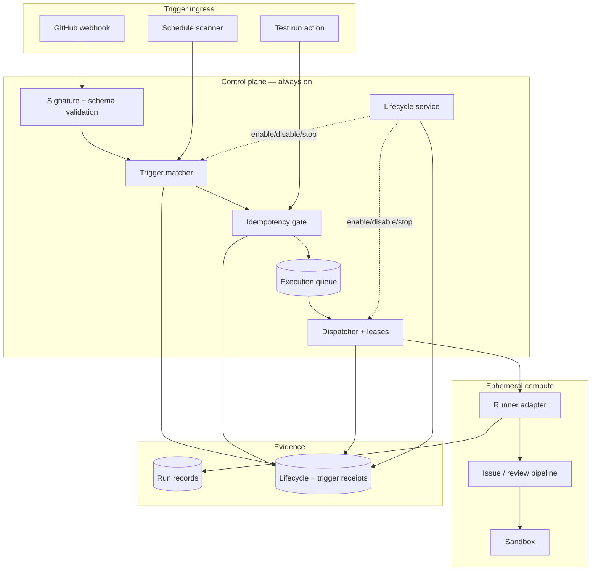
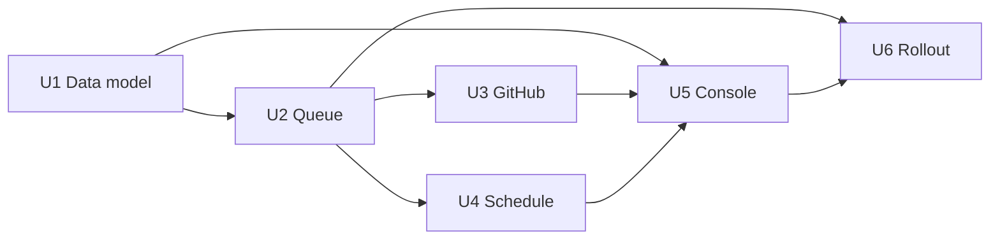

# Shipwright automation agents plan (Phase 2)

## Purpose

Make Shipwright an **always-on cloud-agent platform** with durable agent definitions, GitHub and schedule triggers, explicit enable/disable control, policy-governed execution, and an operator console that makes every configuration and run inspectable.

This is **Phase 2 only** — a planning document, not implementation. It sits above:

- **P0 (delivered):** task-oriented manual operator console (`docs/plans/2026-07-20-feat-operator-console-p0-ux-plan.md`)
- **P1 (in progress):** evidence, recovery, lineage, history, readiness for manual runs (`docs/plans/2026-07-20-feat-operator-console-capabilities-plan.md`)

P1 must complete (or at least land recovery, lineage, and redacted lifecycle evidence) before Phase 2 trigger ingress is enabled in production. P1 does not implement automation entities.

**North star:** Cursor **Agents** capability parity (persistent agents, triggers, lifecycle, configuration, run history/controls, scoped-credential safety). Cursor Automations is a **UX reference** for dense tables, KPIs, and configuration-vs-history separation — not a substitute for the Agents product model.

## Grounding in current Shipwright

Useful seams already exist and must be preserved, not bypassed:

| Layer | Role today | Phase 2 extension |
| --- | --- | --- |
| `ui/shared/operator-run.ts` | Validated request, target, receipt, record, next-action contracts | Link runs to `agentId` + immutable `agentRevisionId`; retain standalone manual runs |
| `ui/server/operator-runs.ts` | Atomic JSON persistence, restart reconciliation, single active run | Becomes a **manual-run adapter**; automation uses a durable control-plane store + queue |
| `src/pipeline/run.ts`, `review-run.ts` | Authorization, sandbox, verification, publication, redacted receipts | Invoked only through a **runner adapter** with pinned policy + scoped credentials |
| P0 console | Paste-and-go intake, presets, skillId, retry/publish-from-prior | Gains an **Agents** area; manual console remains for ad-hoc work |

The JSON run store and single-active-run guard are sufficient for P0/P1 but are **not** a scheduler or cloud control plane. Phase 2 must introduce a transactional store and queue deliberately — not grow the JSON registry into an unbounded daemon.

---

## Requirements

### Agent configuration

- **R1 — Durable agent definitions.** Each agent has a stable ID, display name, instructions, skill ID, target scope (repository/branch rules), verification policy, publication policy, trigger list, enabled flag, revision counter, and creation/update metadata. Configuration used by a run is **immutable** once referenced.
- **R2 — Revision immortality.** Editing an agent creates a new revision; historical runs always resolve to the revision that executed them. Optimistic concurrency prevents silent overwrites.
- **R3 — Default disabled.** New agents are created disabled. No trigger may enqueue work until an operator explicitly enables the agent after trigger validation.

### Triggers and dispatch

- **R4 — GitHub webhook triggers.** Support allowlisted repository events (initial set: issue opened/labeled, pull_request opened/synchronize/reopened, and review-requested variants as validated in td). Every delivery is signature-verified; only bounded, redacted metadata is persisted.
- **R5 — Schedule triggers.** Support validated cron-like schedules with a required IANA timezone, bounded minimum interval, and server-computed next fire time. No arbitrary user code or inbound public HTTP triggers in the first release.
- **R6 — Idempotent enqueue.** Every trigger event carries a durable idempotency key (GitHub delivery ID + agent revision, or schedule occurrence + agent revision). Duplicate delivery or scheduler tick never creates a second execution request.
- **R7 — Durable queue and leases.** Execution requests live in a persistent queue. A dispatcher claims work through transactional leases. Restart resumes dispatch safely; expired leases become visible interrupted/retryable state — never silent re-execution.

### Lifecycle and safety

- **R8 — Explicit lifecycle control.** Enable, disable, pause, resume, edit, delete, and emergency-stop are authenticated, audited state transitions with actor and timestamp.
- **R9 — Policy-governed writes.** Each agent declares `dry_run`, `approval_required`, or `publish_allowed`. `publish_allowed` remains subject to allowlist authorization, verification, branch protections, exact-head checks, and secret/patch policy — it is not a bypass.
- **R10 — Scoped credentials.** The browser never receives GitHub App keys, provider credentials, webhook signing secrets, or full trigger payloads. Executions receive only the scoped credentials and repository access required by the pinned revision.
- **R11 — Global emergency stop.** One operator action halts all new enqueueing and, per configured policy, cancels in-flight lease-held work. Stop state is visible, audited, and requires explicit resume.

### Operator surface and evidence

- **R12 — Agent management UI.** Agents index, detail/configuration, trigger editor, enable/disable, test run, run history, KPI summaries, search/filter, and emergency controls. UI must distinguish **configuration state**, **queued state**, **active state**, and **terminal outcome**.
- **R13 — Evidence and auditability.** Persist redacted config revision snapshots, lifecycle events, trigger receipt metadata, queue state transitions, run phase timeline, and immutable receipt references. Do not persist raw tokens, full webhook payloads, unrestricted prompts, unredacted diffs, or raw provider output.
- **R14 — Single-operator first.** One authenticated operator and one organization/repository allowlist. Data model must not preclude future tenancy; roles, invitations, and billing are out of scope.

### Operations

- **R15 — Cost guardrails.** Before provisioning cloud resources, record per-run and monthly ceilings, owner, idle-cost behavior, teardown path, and monitoring surface in the owning td task. Dead-lettered work and repeated trigger failures alert without retry storms.
- **R16 — Controlled rollout.** Production trigger ingress follows a staged flag sequence (see Rollout). No cloud rollout without cost record, non-production proof, backup/restore drill, and security review.

---

## Durable schemas and entities

All persisted shapes are validated (Zod or equivalent) before write. Secret-valued fields are rejected at schema boundary.

### Agent

Logical agent identity. Mutable display fields only; execution always pins a revision.

| Field | Type | Notes |
| --- | --- | --- |
| `id` | UUID | Stable primary key |
| `name` | string | Operator-facing label |
| `createdAt`, `updatedAt` | ISO-8601 | |
| `enabled` | boolean | **Default false**; toggled via lifecycle events |
| `currentRevisionId` | UUID | Points at latest saved revision |
| `healthSummary` | object | Non-secret: last outcome, consecutive failures, circuit-breaker state |

### AgentRevision (immutable)

| Field | Type | Notes |
| --- | --- | --- |
| `id` | UUID | |
| `agentId` | UUID | |
| `revisionNumber` | integer | Monotonic per agent |
| `instructions` | string | Bounded length; redacted in audit views |
| `skillId` | string | Server-resolved skill |
| `mode` | `issue` or `review` | Pipeline selector |
| `targetScope` | object | `owner`, `repo`, optional branch/ref rules |
| `verifyPolicy` | object | Preset ID or raw command + selection reason |
| `publicationPolicy` | enum | `dry_run`, `approval_required`, or `publish_allowed` |
| `concurrencyLimit` | integer | Default 1 per agent |
| `triggerIds` | UUID[] | References |
| `createdAt` | ISO-8601 | |
| `createdBy` | string | Operator identity |

Once referenced by an ExecutionRequest, a revision row is append-only.

### Trigger

| Field | Type | Notes |
| --- | --- | --- |
| `id` | UUID | |
| `agentId` | UUID | |
| `kind` | `github_webhook` or `schedule` | |
| `enabled` | boolean | Can be disabled independently of agent |
| `github` | object? | `repository`, `events[]`, optional label/branch filters |
| `schedule` | object? | Cron expression, `timezone`, `minimumIntervalMinutes` |
| `nextFireAt` | ISO-8601? | Schedule only; indexed |
| `validationStatus` | enum | `valid`, `invalid`, or `unchecked` |
| `lastValidatedAt` | ISO-8601? | |

### LifecycleEvent (append-only audit)

| Field | Type | Notes |
| --- | --- | --- |
| `id` | UUID | |
| `agentId` | UUID | |
| `revisionId` | UUID? | When applicable |
| `kind` | enum | `created`, `revision_saved`, `enabled`, `disabled`, `paused`, `resumed`, `trigger_added`, `trigger_removed`, `emergency_stop`, `emergency_resume`, `deleted`, `circuit_breaker_tripped`, `circuit_breaker_reset` |
| `actor` | string | Operator or `system` |
| `at` | ISO-8601 | |
| `reason` | string? | Bounded, redacted |

### TriggerReceipt

Bounded record of an inbound trigger (not the raw payload).

| Field | Type | Notes |
| --- | --- | --- |
| `id` | UUID | |
| `triggerId` | UUID | |
| `idempotencyKey` | string | Unique index |
| `source` | enum | `github`, `schedule`, or `test_run` |
| `deliveryId` | string? | GitHub `X-GitHub-Delivery` |
| `eventType`, `action` | string? | GitHub |
| `repository` | string | `owner/repo` |
| `ref` | string? | Safe ref identifier |
| `receivedAt` | ISO-8601 | |
| `matched` | boolean | Whether an agent trigger matched |
| `executionRequestId` | UUID? | Set when enqueued |

Raw webhook body is discarded after matching.

### ExecutionRequest (immutable)

| Field | Type | Notes |
| --- | --- | --- |
| `id` | UUID | |
| `agentId`, `agentRevisionId` | UUID | Pinned config |
| `triggerReceiptId` | UUID? | Null for manual test runs |
| `source` | enum | `github`, `schedule`, `test_run`, or `manual` |
| `idempotencyKey` | string | Unique |
| `targetSnapshot` | object | Parsed URL/PR/issue identifiers at enqueue time |
| `policySnapshot` | object | Publication + verify policy copy |
| `status` | enum | See queue states below |
| `runId` | UUID? | Links to OperatorRunRecord once dispatched |
| `enqueuedAt`, `startedAt`, `finishedAt` | ISO-8601? | |

### OperatorRunRecord (extended)

Existing P0/P1 record plus optional automation fields:

| Field | Type | Notes |
| --- | --- | --- |
| `agentId` | UUID? | Null for legacy/manual runs |
| `agentRevisionId` | UUID? | |
| `executionRequestId` | UUID? | |
| `triggerSource` | enum? | `manual`, `test_run`, `github`, or `schedule` |

Legacy records without these fields remain valid standalone runs.

### Queue states

`queued` → `claimed` → `running` → (`succeeded`, `failed`, `canceled`, or `interrupted`) or `dead_letter`.

---

## Execution and trigger architecture

### Trigger path (GitHub)

1. **Verify** HMAC signature before parsing.
2. **Match** only enabled agents whose trigger scope includes the repository and event/action.
3. **Idempotency** — insert TriggerReceipt + ExecutionRequest in one transaction; duplicate delivery returns existing request ID.
4. **Dispatch-time authorization** — re-resolve target/preflight at claim time; if no longer allowed, fail the request visibly without disabling the agent globally.

### Trigger path (schedule)

1. **Scan** due triggers with indexed `nextFireAt` query (bounded batch).
2. **Claim occurrence** using schedule occurrence + revision as idempotency key.
3. **Advance** `nextFireAt` atomically with enqueue.
4. **Circuit breaker** — consecutive failures pause the trigger; operator must resume.

### Dispatch path

1. **Claim** next eligible request with a lease (TTL configurable; default aligns with run timeout + grace).
2. **Pin** revision and policy; invoke runner adapter with AbortSignal.
3. **Record** phase progress into existing run record contracts; receipt redaction unchanged.
4. **Terminalize** queue entry; append lifecycle event on policy violations or circuit-breaker trips.
5. **Restart** — reclaim expired leases as `interrupted`; no automatic rerun until explicit retry policy (initially: operator test-run or manual retry only).

### Concurrency defaults

- One active execution per agent.
- One global active execution (configurable raise after U6 rollout proof).
- Emergency stop overrides all concurrency slots.

---

## Enable, disable, and emergency-stop semantics

### Agent enabled flag

| State | New enqueue | In-flight work | Triggers evaluated |
| --- | --- | --- | --- |
| **Disabled** (default) | No | Existing leases run to completion or cancel per policy | No |
| **Enabled** | Yes, if triggers match and global stop clear | Normal | Yes |
| **Paused** | No | Existing leases run to completion | No |
| **Circuit-breaker paused** | No | No new claims | No; requires operator reset |

`disable` is immediate for **new** work. It does not delete revisions or history.

### Trigger-level enable

A trigger may be disabled while the agent remains enabled. Disabled triggers are skipped during matching without mutating agent-level enable state.

### Emergency stop (global)

| Aspect | Behavior |
| --- | --- |
| **Scope** | Entire automation plane (all agents) |
| **Enqueue** | Blocked immediately |
| **In-flight** | Cancel when agent publicationPolicy is dry_run or when cancel is allowed by policy; otherwise mark interrupted at lease expiry |
| **Audit** | LifecycleEvent kind emergency_stop with actor |
| **Recovery** | Explicit emergency_resume; does not auto re-enable agents — each agent remains in its pre-stop enabled/disabled state |
| **UI** | Prominent control on Agents index and global header; requires confirmation |

### Delete semantics

Deleting an agent soft-deletes: triggers stop matching; history and audit remain addressable by ID. Hard purge is out of scope for Phase 2.

---

## UI surfaces

Phase 2 adds an **Agents** area alongside the existing manual console. Manual paste-and-go intake remains for ad-hoc runs.

### Agents index

- Table: name, enabled/disabled, last outcome, 7-day run count, success rate, next scheduled fire, circuit-breaker badge.
- Filters: enabled state, repository, outcome, trigger kind.
- Search: agent name, repository.
- Actions: create agent, emergency stop (global), refresh.

### Agent detail — Configuration tab

- Instructions editor (bounded), skill picker, mode, target scope, verify policy, publication policy (with explicit warnings for publish_allowed).
- Trigger list with add/edit/disable; validation status per trigger.
- Revision number, last audit event, save draft, **Enable** (disabled until triggers validate).
- Secret binding names only (e.g., webhook secret configured: yes/no).

### Agent detail — Runs tab

- Reuse P0/P1 receipt/evidence components: phase timeline, verify result, redacted receipt, next-action CTAs where applicable.
- Filter by status, date, trigger source.
- Test run button (creates test_run execution without trigger).

### Agent detail — Audit tab

- Append-only lifecycle events and trigger receipts (redacted).
- Enable/disable/stop/resume history.

### Global manual console (unchanged role)

- Ad-hoc issue/PR runs without an agent definition.
- History shows both manual and agent-attributed runs with source badge.

### Responsive contract

All new surfaces must work at desktop and 390px width, consistent with P0 proof standards.

---

## Migration and security boundaries

### Store migration

| Phase | Store | Contents |
| --- | --- | --- |
| P0/P1 | JSON file (OperatorRunRegistry) | Manual run records |
| Phase 2 U1+ | Transactional DB (Postgres-compatible or equivalent) | Agents, revisions, triggers, queue, audit |
| Bridge | Dual-write not required | Manual runs may continue on JSON until adapter proves parity; agent runs always use DB |

Migration steps (planning only):

1. Introduce DB schema and store interface behind feature flag.
2. Backfill is not required for legacy runs; link forward only.
3. Prove backup/restore and lease recovery on empty + fixture DB before enabling triggers.
4. JSON registry remains read/write for manual console until explicit cutover td.

### Security boundaries (non-negotiable)

| Boundary | Rule |
| --- | --- |
| **Credentials** | Host/server only; never in browser, agent instructions, or persisted trigger payloads |
| **Allowlist** | Unchanged; dispatch-time re-authorization |
| **Publication** | Pipeline gates unchanged; automation policy selects whether publish is attempted, not whether gates apply |
| **Redaction** | All new persisted fields pass existing redactSecrets or schema rejection |
| **Webhook ingress** | Signature required; rate-limit per delivery ID; no unauthenticated enqueue |
| **Operator auth** | Same single-operator session model as P0 until tenancy Phase |
| **Emergency stop** | Cannot be triggered by trigger ingress — operator action only |

### P1 to Phase 2 dependency

Phase 2 should consume P1 phaseLog, lineage fields, and recovery selection in the manual console so agent run history presents consistent evidence. Phase 2 must not re-specify those contracts.

---

## Implementation units (U1+)

Stable planning units. **No code in this document** — each unit gets its own td child and worktree when implementation begins.

### U1 — Agent and execution data model

**Goal:** Persistent agents, immutable revisions, triggers, lifecycle events, execution requests, and run linkage — no trigger ingress yet.

**Requirements:** R1, R2, R3, R13, R14.

**Acceptance:** Create disabled agent + revision in DB; optimistic conflict detected; lifecycle events append; legacy manual runs still load from JSON; no secret fields persist.

### U2 — Queue, lease, dispatcher, cancellation

**Goal:** Turn a pinned execution request into one observable pipeline invocation with exactly-once intent (at-least-once delivery with idempotent dedupe).

**Requirements:** R6, R7, R9, R10, R13, R15.

**Acceptance:** Duplicate enqueue rejected; lease expiry becomes interrupted; cancel propagates AbortSignal; dispatcher restart simulation leaves explicit state; dry-run policy enforced at adapter boundary.

### U3 — GitHub webhook trigger path

**Goal:** Authenticated, idempotent agent executions from allowlisted GitHub events.

**Requirements:** R4, R6, R7, R9, R10, R13.

**Acceptance:** Signed fixture produces one queued request; replay produces no duplicate; disabled agent produces receipt only; invalid signature returns 401 and no enqueue.

### U4 — Schedule triggers and lifecycle API

**Goal:** Recurring work with timezone-safe scheduling, pause/disable/stop, and failure circuit breaker.

**Requirements:** R5, R6, R8, R11, R15.

**Acceptance:** DST transition test; disable-before-fire issues no enqueue; circuit breaker pauses after N failures; emergency stop blocks schedule scanner claims.

### U5 — Agent management console

**Goal:** Operator surfaces for create/configure/enable/test/history/audit.

**Requirements:** R3, R8, R11, R12, R13, R14.

**Acceptance:** Browser proof of disabled → configure → validate trigger → enable → test run → inspect history → disable; no secret values in network responses; 390px layout verified.

### U6 — Production deployment, observability, staged rollout

**Goal:** Operate always-on control plane safely before unattended publication.

**Requirements:** R15, R16, R10, R13.

**Acceptance:** Non-prod signed webhook → dry run → receipt + metric; control-plane restart recovery; rollout flags enforce stage order; cost/td record exists before cloud provisioning.

### Sequencing

U1 and U2 are serial prerequisites. U3 and U4 parallelize after U2. U5 integrates after lifecycle APIs stabilize. U6 is last and sole cloud-infra activator.

---

## Validation and acceptance

### Automated (per unit)

- Schema rejection of secret-like fields.
- Idempotency and lease simulations.
- Lifecycle state machine transitions.
- Redaction golden tests on new audit views.
- Existing P0/P1 operator-run tests remain green.

### End-to-end acceptance (Phase 2 complete)

- Operator creates a disabled agent, saves revision, adds validated trigger, explicitly enables.
- Valid GitHub delivery or schedule occurrence creates one queued execution; replay does not duplicate.
- Disable and emergency stop prevent new work; cancellation and terminal evidence are visible and audited.
- Every agent run resolves to immutable revision, policy, trigger source, and redacted receipt.
- publish_allowed agent still fails closed on allowlist, verification, branch protection, secret, and exact-head checks.
- Restart and lease expiry leave recoverable state without silent re-execution.
- Browser proof: full lifecycle at desktop and 390px.
- Security review + backup/restore drill completed before production triggers.

### Pre-implementation validation task

Observe authenticated Cursor Agents product (when available) to confirm KPI fields, trigger UX, and stop semantics — adjust UI acceptance criteria only; do not chase pixel parity.

---

## Rollout and cost constraints

### Staged rollout flags (strict order)

1. **Data model only** — agents creatable, disabled, no triggers.
2. **Test run only** — manual test executions via adapter; no webhook/schedule.
3. **Dry-run triggers** — GitHub/schedule enqueue; pipeline forced to dry_run regardless of agent policy.
4. **Approval-required** — triggers enqueue; publication requires operator approval step (extends P0 confirmation pattern).
5. **Publish allowed** — per-agent opt-in; td security sign-off required per agent.

### Cost constraints

- Control plane: one small always-on instance acceptable; document monthly ceiling in td before provision.
- Agent compute: ephemeral workers scale to zero; no persistent paid sandbox volumes.
- Schedule minimum interval: default 15 minutes unless td documents exception.
- Concurrency: start at one global active execution.
- Alerts: queue depth, stale leases, dead letters, circuit breakers — no raw payload in alerts.
- Local development: must not create paid cloud resources; use test store and mocked dispatcher.

---

## Explicit out of scope

- Multi-operator tenancy, RBAC, invitations, team filters, billing, cross-org agent sharing.
- Arbitrary inbound public HTTP triggers, user-supplied code hooks, arbitrary shell from trigger payload.
- Autonomous self-modification of agent instructions, policies, tools, or credentials.
- Full pixel/API replication of Cursor's private Agents implementation.
- Provider billing integrations and always-on agent compute (workers remain ephemeral).
- Hard purge of deleted agents or audit history.
- Webhook-driven queue for manual P0 runs (manual console stays operator-initiated).
- Replacing or retroactively rewriting P0/P1 delivered scope.

---

## Risks and mitigations

| Risk | Mitigation |
| --- | --- |
| Webhook replay / duplication | Signature verification + idempotency keys before enqueue |
| Unattended publication blast radius | Default dry run; staged rollout; pipeline gates unchanged |
| Queue corruption / double dispatch | Transactional claims/leases; immutable revisions; restart tests |
| Recurring cost growth | Schedule bounds, scale-to-zero workers, budget alerts, td cost record |
| Secrets in automation metadata | Schema rejection + redaction; server-side credentials only |
| Plan scope drift | Agents capability parity, not Automations-only UX; P1 stays separate |

---

## Decision record

- **2026-07-21:** User set Cursor Agents parity as explicit end goal.
- **2026-07-21:** P0 remains delivered; P1 remains manual-operator sequence; Phase 2 is this document.
- **2026-07-21:** Supersedes `docs/plans/2026-07-21-shipwright-cursor-agents-parity-plan.md` as the canonical Phase 2 plan filename for implementation tracking.
- **2026-07-21:** Public cursor.com/agents requires sign-in; capability parity is the contract until product observation task runs.
