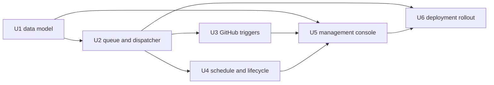

# Shipwright Cursor Agents parity plan

## Purpose

Make Shipwright an always-on cloud-agent platform with durable agent definitions, event and schedule triggers, explicit enable/disable control, policy-governed execution, and an operator console that makes every configuration and run inspectable.

This is **Phase 2** — a separate plan from delivered P0 and from the P1 manual-operator capability sequence. Do not ship or merge the `feat/operator-console-capability-plan` draft as the automation answer; any “deferred to Phase 2” language there is superseded by this document.

**Delivered P0** (`docs/plans/2026-07-20-feat-operator-console-p0-ux-plan.md`) stays unchanged: task-oriented cockpit, presets, `skillId`, retry/publish-from-prior-inputs, demo/live disclosure. **P1** (evidence, recovery, lineage, history, readiness in `docs/plans/2026-07-20-feat-operator-console-capabilities-plan.md`) may land in parallel; it must not block or replace this automation phase.

## Product target

Cursor Agents is the capability north star; Cursor Automations is the UX reference. Direct public retrieval of `https://cursor.com/agents` requires sign-in, so this plan targets observable product capabilities rather than claiming implementation or pixel parity:

- Named, persistent cloud agents rather than one-off local runs.
- Agent-owned configuration: instructions, allowed tools, repository and branch scope, verification policy, and publication policy.
- GitHub webhook, schedule, and validated trigger ingress that create durable, idempotent execution requests.
- Explicit enable/disable controls, with auditable lifecycle changes and a global emergency stop.
- A dense operator surface: agent health and KPIs, searchable agent/run history, configuration separate from execution evidence, test-run support, and safe recovery.

## Grounding

The current implementation already supplies useful seams:

- `ui/shared/operator-run.ts` owns validated issue/review request, target, pinned snapshot, receipt, record, and next-action contracts.
- `ui/server/operator-runs.ts` persists records atomically, reconciles interrupted runs, executes through an `AbortSignal`, and currently enforces one active run.
- `src/pipeline/run.ts` and `src/pipeline/review-run.ts` own authorization, ephemeral workspace setup, verification, publication, redacted receipts, and phase progress.
- P0 (`docs/plans/2026-07-20-feat-operator-console-p0-ux-plan.md`) already supplies URL preflight, server-owned verification presets, named skills, retry/publish-from-prior-inputs, and demo/live disclosure.

The JSON run store and single-active-run guard are sufficient for the P0 console but are not a durable scheduler or cloud-agent control plane. Phase 2 must replace or encapsulate those limits deliberately rather than quietly turning the existing registry into an unbounded daemon.

## Requirements

- **R1 — Durable agent definitions.** An agent has a stable ID, name, instructions, skill ID, target scope, verification policy, publication policy, trigger list, enabled state, revision, creation/update metadata, and non-secret health summary. Configuration revisions are immutable once used by a run.
- **R2 — Trigger safety.** GitHub webhook and schedule triggers validate their source before enqueueing. Every trigger event carries a durable idempotency key; duplicate delivery never creates a second execution.
- **R3 — Explicit lifecycle control.** Agents start disabled. Enabling, disabling, pausing, resuming, editing, deleting, and emergency-stopping are authenticated, audited state transitions. Disable prevents new enqueueing; stop may cancel active work according to an explicit per-agent policy.
- **R4 — Durable dispatch.** A persistent queue stores immutable execution requests. A restart resumes dispatch of safe queued work, marks interrupted work accurately, and never reruns an in-flight execution without an explicit retry policy.
- **R5 — Controlled cloud execution.** Control-plane hosting is always on; agent compute is ephemeral and scales to zero when idle. Each execution receives only the scoped credentials, repository access, tool allowlist, time limit, and concurrency slot required by its pinned agent revision.
- **R6 — Policy-governed writes.** Every agent declares `dry_run`, `approval_required`, or `publish_allowed` publication policy. `publish_allowed` remains subject to allowlist authorization, verification, branch protections, exact-head checks, and secret/patch policy; it is not a bypass.
- **R7 — Operator parity surface.** The console provides an agents index, agent detail/configuration, trigger and enabled-state controls, test run, run history, KPI summaries, search/filtering, per-run evidence, and emergency controls. The UI must distinguish configuration state, queued state, active state, and terminal outcome.
- **R8 — Evidence and auditability.** Persist redacted config revisions, lifecycle events, trigger receipt metadata, queue state, run phase timeline, and immutable receipt references. Do not persist raw tokens, full webhook payloads, unrestricted prompts, unredacted diff content, or raw provider output.
- **R9 — Single-operator first.** Initial delivery supports one authenticated operator and one organization/repository allowlist. The data model must not preclude future tenancy, but roles, invitations, and billing separation are not Phase 2 scope.
- **R10 — Cost and operational guardrails.** Before provisioning any cloud resource, record per-run and monthly ceilings, owner, idle-cost behavior, teardown path, and monitoring surface in the owning td task. Dead-lettered work and repeated trigger failures alert the operator without creating a retry storm.

## Decisions

1. **Use agent definitions, not expanded run forms.** A run is an immutable execution request created from an agent revision plus trigger payload reference. Editing an agent never mutates historical runs.
2. **Use a durable queue, not `setInterval` work.** Trigger handlers write queue entries transactionally; one dispatcher claims and leases jobs. A lease expiry transitions a job into visible interrupted/retryable state rather than silently executing it again.
3. **Start with one provider-neutral runner interface.** The dispatcher invokes the existing issue/review pipeline through an adapter. The adapter receives a pinned revision and policy context; it does not know whether activation came from GitHub, a schedule, or a test run.
4. **Support GitHub webhook and schedule triggers first.** Webhook validation and idempotency land before schedule syntax. Schedule support accepts one explicit timezone per agent and computes the next run server-side; no arbitrary user code or inbound public HTTP trigger is in the first release.
5. **Make autonomy policy explicit.** `publish_allowed` is a deliberate configuration choice, not the global default. The default remains `dry_run`; enabled agents can nevertheless execute unattended under their declared policy.
6. **Keep credentials server-side and scoped.** The browser never receives GitHub App keys, provider credentials, signing secrets, or full trigger payloads. Secret binding names may be shown; values may not.
7. **Adopt a real durable control-plane store before enabling triggers.** The implementation spike chooses a managed Postgres-compatible or equivalent transactional store with migration, backup, and lease support. The current JSON file store remains a P0/demo adapter, not the production scheduler source of truth.

## Implementation units

### U1. Agent and execution data model

**Goal:** Introduce persistent agent definitions, immutable revisions, lifecycle events, trigger records, queue entries, and run-to-revision links without enabling any trigger.

**Requirements:** R1, R3, R4, R8, R9.

**Files:** New control-plane schema/store modules under `ui/server/`; `ui/shared/agent-definition.ts` and tests; narrow additions to `ui/shared/operator-run.ts`; migration and repository configuration docs.

**Approach:**
1. Define Zod contracts for agent draft, revision, trigger, lifecycle event, execution request, queue state, and audit view.
2. Add optimistic revision checks so concurrent edits cannot silently overwrite configuration.
3. Persist creation, update, enable/disable, and policy changes as append-only lifecycle events.
4. Link every execution record to `agentId` and `agentRevision`; legacy P0 runs remain valid standalone records.
5. Provide a store interface with transactional migration and a test implementation; do not move P0 storage until the adapter passes the same run-history tests.

**Tests:** Validation boundaries; revision conflict; immutable historic revision; lifecycle audit ordering; migration of legacy standalone runs; no secret-valued field accepted by any persisted schema.

**Verification:** Focused shared/server tests plus a migration smoke against an empty store and a fixture containing legacy P0 records.

### U2. Queue, lease, dispatcher, and cancellation boundary

**Goal:** Turn a pinned execution request into one exactly-once-intended, observable pipeline invocation.

**Requirements:** R4, R5, R6, R8, R10.

**Files:** New queue/dispatcher modules under `ui/server/`; adapter around existing pipeline dependencies; focused tests; deployment documentation.

**Approach:**
1. Enqueue immutable requests with idempotency key, schedule time, priority, and pinned agent revision.
2. Claim work through transactional leases; expose queued, claimed, running, succeeded, failed, canceled, interrupted, and dead-letter states.
3. Call existing pipeline adapters with an `AbortSignal`, scoped credentials, and the pinned verification/publication policy.
4. On restart, reclaim only expired leases into visible interrupted/retryable state; no automatic rerun until retry policy exists.
5. Enforce configurable per-agent and global concurrency limits; initial defaults are one active execution per agent and one global execution.

**Tests:** Duplicate enqueue; competing claimers; lease expiry; cancellation; dispatcher restart; no second invocation for duplicate event; dead-letter threshold; policy passed unchanged to runner.

**Verification:** Deterministic multi-dispatcher simulation and an isolated demo run that queues, claims, cancels, and records a receipt without publishing.

### U3. GitHub webhook trigger path

**Goal:** Create authenticated, idempotent agent executions from allowlisted GitHub events.

**Requirements:** R2, R4, R5, R6, R8.

**Files:** Webhook route/handler; signature verifier; trigger matcher; queue integration; test fixtures; deployment docs for the webhook endpoint and secret binding.

**Approach:**
1. Verify the GitHub webhook signature before parsing the event.
2. Store only event type, delivery ID, repository/ref identifiers, and bounded safe target fields; discard the raw payload after matching.
3. Match only enabled agent triggers scoped to the configured repository and supported event/action combination.
4. Use GitHub delivery ID plus agent revision as the idempotency key.
5. Resolve target/preflight again at dispatch time; disable only the affected execution when the target is no longer allowed.

**Tests:** Invalid signature; duplicate delivery; disabled agent; unmatched repository/event; matched PR/issue delivery; redaction; dispatch-time authorization change.

**Verification:** Signed local fixture reaches one queued run; replaying the same delivery leaves queue count unchanged.

### U4. Schedule triggers and lifecycle semantics

**Goal:** Enable predictable recurring work with explicit time, pause, disable, emergency-stop, and recovery behavior.

**Requirements:** R2, R3, R4, R10.

**Files:** Schedule parser/next-run calculator; scheduler service; lifecycle service/actions; tests; operator/deployment docs.

**Approach:**
1. Support validated cron-like schedules with a required IANA timezone and a bounded minimum interval.
2. Compute and persist the next fire time; scheduler scans due triggers with an indexed bounded query, then enqueues using schedule occurrence as the idempotency component.
3. Disabling an agent atomically prevents future occurrence claims. Emergency stop additionally cancels lease-held work when its agent policy permits cancellation.
4. Record skip, pause, disable, stop, and retry decisions in lifecycle/audit history.
5. Enforce a per-agent failure circuit breaker that pauses the trigger after a configured consecutive-failure threshold and requires operator resume.

**Tests:** Timezone and DST transitions; minimum interval; duplicate scheduler ticks; disable-vs-due race; emergency stop; circuit breaker; restart with overdue schedule.

**Verification:** Time-controlled scheduler test demonstrates exactly one enqueue per occurrence and no enqueue after disable.

### U5. Agent management console

**Goal:** Give an operator a dense, safe surface for creating and managing cloud agents.

**Requirements:** R1, R3, R6, R7, R8, R9.

**Files:** Agent list/detail/config components and actions; shared view models/tests; focused styling; `ui/README.md`.

**Approach:**
1. Add an Agents index with enabled/disabled state, current/next activity, last outcome, seven-day runs/success rate, search, and filters.
2. Add detail sections for configuration, triggers, run history, and evidence. Configuration shows instructions, repository/branch scope, tool/skill selection, verification, and publication policy without exposing secrets.
3. Require an explicit save for draft revisions and an explicit enable after trigger validation; show revision and last audit event.
4. Offer test run, pause/disable, and emergency stop as distinct actions with confirmations proportional to impact.
5. Reuse existing receipt/evidence components rather than creating a chat transcript as the primary history surface.

**Tests:** Disabled-by-default create; revision save/enable flow; policy copy; test run uses pinned draft/revision; toggle and emergency control permissions; list filters/KPI projections; secret values absent from UI action responses.

**Verification:** Browser demo at desktop and 390 px: create dry-run agent, add a trigger, enable, inspect queued/terminal run, disable, and confirm history/audit visibility.

### U6. Production deployment, observability, and staged rollout

**Goal:** Operate the always-on control plane safely before granting unattended publication.

**Requirements:** R5, R6, R8, R10.

**Files:** Deployment manifests/configuration; readiness/metrics/alert integration; runbook; cost record in td; operator docs.

**Approach:**
1. Deploy a control-plane service, transactional store, scheduler, and dispatcher with health/readiness endpoints; agent compute remains ephemeral.
2. Add redacted metrics for queue depth, lease age, trigger deliveries, dispatch latency, success/failure/cancellation, dead letters, and paused circuit breakers.
3. Set alerts for stale leases, dead letters, unexpected queue growth, and scheduler failure; never send raw payloads, prompt contents, or credentials.
4. Roll out in order: data model + disabled agents → test-run-only → enabled dry-run triggers → approval-required publication → explicitly selected `publish_allowed` agents.
5. Record approved cost ceilings and teardown steps before activating the first cloud resource. Do not create a persistent paid resource during local development.

**Tests:** Deployment configuration validation; metric redaction; readiness failure modes; staged policy flags; rollback and backup/restore drill.

**Verification:** Isolated non-production environment receives a signed event, dispatches a dry run, exposes a redacted receipt/metric, survives a control-plane restart, and leaves no live publish side effect.

## Sequencing

- U1 and U2 are serial control-plane prerequisites.
- U3 and U4 may proceed in parallel after U2 with separate write ownership.
- U5 begins data-contract work after U1 but integrates after U3/U4 lifecycle APIs stabilize.
- U6 is last; it is the only unit allowed to activate cloud infrastructure.

## Validation and acceptance

- An operator can create a disabled agent, review its revision, add an allowlisted trigger, and explicitly enable it.
- A valid GitHub delivery or schedule occurrence creates one queued execution; replay or scheduler restart does not duplicate it.
- Disable and emergency stop prevent new work; cancellation and terminal evidence are visible and audited.
- Every run resolves to an immutable agent revision, a policy, a trigger or test-run source, and a redacted receipt.
- A `publish_allowed` agent still fails closed on allowlist, authorization, verification, branch-protection, secret, and exact-head checks.
- Restart, lease expiry, and repeated failures leave explicit, recoverable state; no silent re-execution occurs.
- Browser proof demonstrates the complete disabled → configured → enabled → triggered → run-history → disabled lifecycle at desktop and 390 px.
- No cloud rollout proceeds without the td cost record, non-production proof, backup/restore drill, and a security review.

## Deferred and out of scope

- Multi-operator tenancy, role management, team filters, customer billing, and cross-organization agent sharing.
- Arbitrary inbound public HTTP triggers, arbitrary shell execution, user-provided code hooks, and raw diff/prompt archives.
- Autonomous self-modification of agent instructions, policies, tools, or credentials.
- Full pixel/API replication of Cursor’s private Agents implementation.
- Provider-specific billing integrations and persistent always-on agent compute; the control plane is always on while workers remain ephemeral.

## Risks and mitigations

- **Webhook replay or duplication:** Verify signatures and store delivery-based idempotency keys before enqueueing.
- **Unattended publication blast radius:** Default to dry run, require per-agent policy, retain pipeline gates, and roll out `publish_allowed` last.
- **Queue corruption or duplicate dispatch:** Use transactional claims/leases, immutable revisions, and restart simulation tests.
- **Recurring cost growth:** Bound schedule cadence/concurrency, scale workers to zero, set budget alerts, and record ceilings before provisioning.
- **Secrets in automation metadata:** Keep secret values server-side, validate schemas, and reuse receipt redaction before persistence or display.
- **Plan scope drift:** Treat Cursor Agents as capability parity; do not copy private UI/API details or fold P1 evidence work into this phase.

## Decision record

- **2026-07-21:** The user set Cursor Agents parity—not merely Cursor Automations-inspired UX—as Shipwright’s explicit end goal.
- **2026-07-21:** Preserve P0 as delivered and retain P1 as a separate operator-capabilities sequence. This Phase 2 plan supersedes automation/deferral language in the capabilities draft and makes the always-on cloud-agent target actionable without retroactively altering delivered scope.
- **2026-07-21:** Public `cursor.com/agents` redirects to authentication. The plan therefore uses capability parity as the contract and reserves authenticated-product observation as a pre-implementation validation task.
